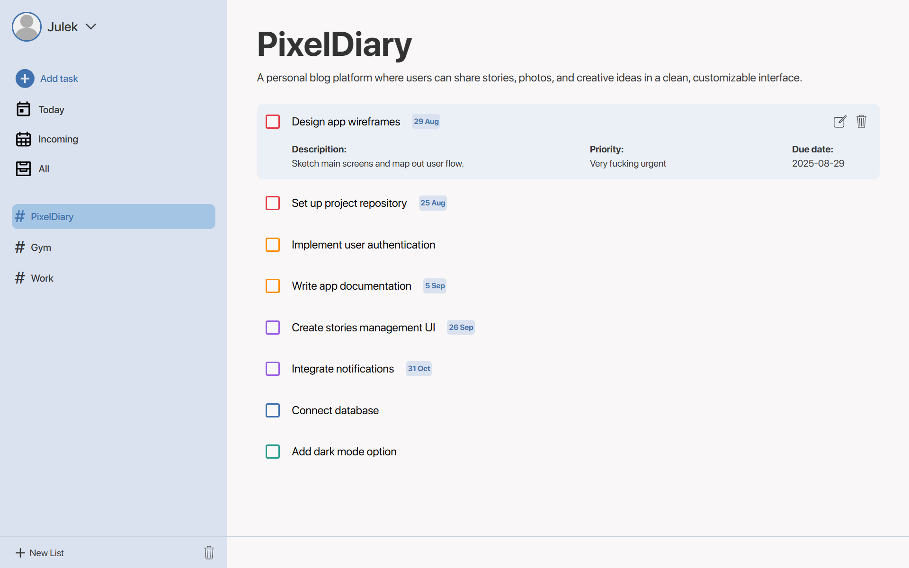
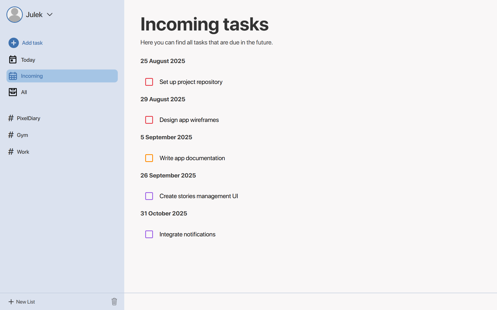
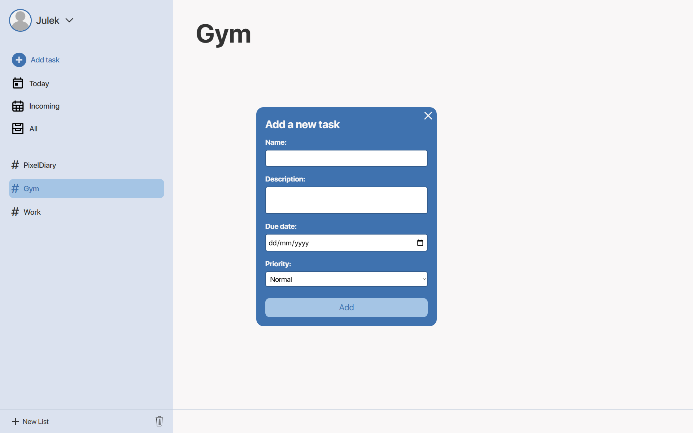

# Doit

Doit is a modern and intuitive task management web application designed to help you organize your projects and daily tasks efficiently. Built with JavaScript, CSS, and Webpack, Doit offers a clean interface and smooth user experience, making productivity enjoyable.

## Features

- **Project Management:** Create, edit, and delete projects.
- **Task Tracking:** Add, complete, edit and remove tasks with ease.
- **User-Friendly Interface:** Designed to be easy and intuitive.
- **Persistent Data:** Your tasks and projects are saved locally.

## Getting Started

1. Clone the repository or download the project files.
2. Install dependencies:
	 ```sh
	 npm install
	 ```
3. Start the development server:
	 ```sh
	 npm start
	 ```
4. Open your browser and navigate to `http://localhost:8080` (or the port shown in your terminal).

## Screenshots

Below are some screenshots of the Doit app in action:

### Dashboard


### Incoming page


### Adding a task


## Folder Structure

```
Doit/
	src/
		js/           # JavaScript modules
		imgs/         # Images and screenshots
		font/         # Custom fonts
		style.css     # Main stylesheet
		template.html # HTML template
	webpack.config.js
	package.json
	README.md
```

## License
`
This project is for educational purposes and personal use.